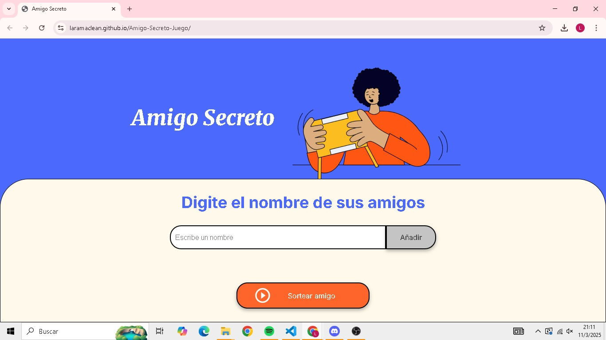
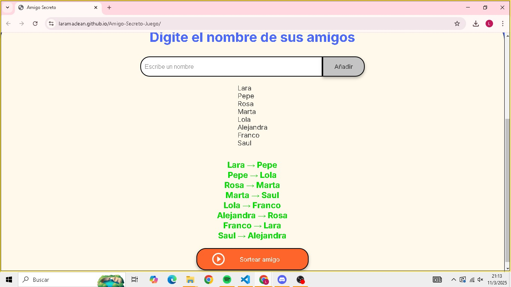

# 🎉  Amigo-Secreto-Juego

Implementación del desafio del amigo secreto

Este es un juego en el cual se realiza un listado de nombres y, al apretar el botón "Sortear amigo", la página asigna a cada nombre de la lista el nombre de su amigo secreto.

# 🚀 ¿Cómo funciona?
1)- Ingresa los nombres de los participantes.

2)- Presiona el botón "Sortear amigo".

3)- La aplicación asignará aleatoriamente un amigo secreto a cada persona.

¡Diviértete descubriendo quién es tu amigo secreto!

# 📸 Capturas de pantalla  
Pantalla principal:  
  

Resultado del sorteo:  
  

# 🎥 Video de demostración  
🔗 [Mira el video aquí](https://youtu.be/BNNYcgrQPng)  
